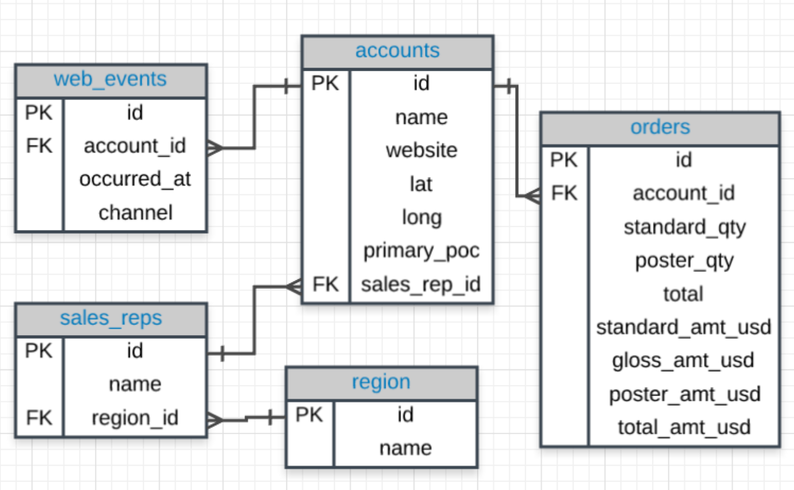

# Basic SQL.

One way to store data is to use spreadsheets. To visualize the relationships between spreadsheets using **ERD** (Entity Relationship Diagram). Each spreadsheet is represented on a table. At the top is a name of the table, below each column name is listed. For example:

SQL is a language used to interact with a database. It can query one table or across multiple tables.

Database is a collection of tables that share connected data tored in a computer.

Below is the ERD for the database we will use from Parch & Posey. These diagrams help you visualize the data you are analyzing including:

1. The names of the tables.
2. The columns in each table.
3. The way the tables work together.
4. You can think of each of the boxes below as a spreadsheet.

Note: glossy_qty is incorrect, it is actually gloss_qty in the database