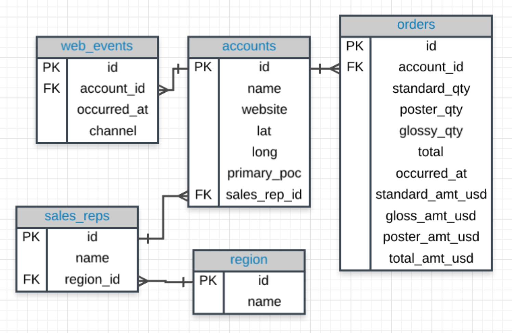
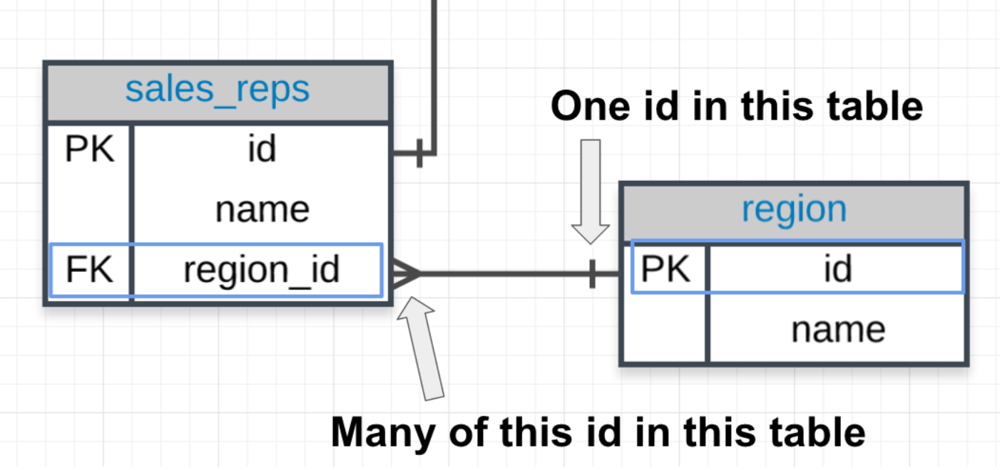

## Relational DB

The term **relational database** refers to the fact that tables within it relate to one another. They contain common identidiers that allow information from 
multiple tables to be easily combined.

When you write a query it's execution speed depends on the amount of data you're asking the db to read and the number and type of calculation you're
asking it to make.

## DB normailization.

When creating a db, it's really important to think about how data will be stored. This is known as **normalization**.
There are essentially three ideas that are aimed at database normalization:

1. Are the tables storing logical groupings of the data?
2. Can I make changes in a single location, rather than in many tables for the same information?
3. Can I access and manipulate data quickly and efficiently?

[Why You Need Database Normalization link](http://www.itprotoday.com/microsoft-sql-server/sql-design-why-you-need-database-normalization)

Example:
Here we are only pulling data from the orders table since in the SELECT statement we only reference columns from the orders table.
The ON statement holds the two columns that get linked across the two tables.


To specify tables and columns in the SELECT statement:

1. The table name is always before the period.
2. The column you want from that table is always after the period.

For example, if we want to pull only the account name:

```
SELECT accounts.name, orders.occurred_at
FROM orders
JOIN accounts
ON orders.account_id = accounts.id;
```
This query only pulls two columns, not all the information in these two tables.

## ERD reminder.

ERD or entity relationship diagram is a common way to view data in a database. 


The PK here stands for primary key. A primary key exists in every table, and it is a column that has a unique value for every row.
If you look at the first few rows of any of the tables in our database, you will notice that this first, PK, column is always unique. For this database it is always called id, but that is not true of all databases.

## Primary and Foreign Keys.

`Primary Key (PK)`
A primary key is a unique column in a particular table. This is the first column in each of **our tables**. Here, those columns are all called id, but that doesn't necessarily have to be the name. It is common that the primary key is the first column in our tables in most databases.

The primary key is a single column that must exist in each table of a database. Again, these rules are true for most major databases, but some databases may not enforce these rules.

`Foreign Key (FK)`
A foreign key is when we see a primary key in another table. 

Foreign keys are always associated with a primary key, and they are associated with the crow-foot notation above to show they can appear multiple times in a particular table.



## JOIN more than two tables.

```
SELECT *
FROM web_events
JOIN accounts
ON web_events.account_id = accounts.id
JOIN orders
ON accounts.id = orders.account_id;
```

## ALIAS

When we `JOIN` tables together it's easiest to give your table names **aliases**. The `ALIAS` for a table will be created in the `FROM` or `JOIN` clauses.
Best practice: to use all lower case letters and underscores instead of spaces.
Example:
```
FROM tablename AS t1
JOIN tablename2 AS t2
```
Or without the AS statement:
```
FROM tablename t1
JOIN tablename2 t2
```

We can simply write our alias directly after the column name (in the SELECT) or table name (in the FROM or JOIN) by writing the alias directly following the column or table we would like to alias. 
```
SELECT col1 + col2 total, col3
```

```
Select t1.column1 aliasname, t2.column2 aliasname2
FROM tablename AS t1
JOIN tablename2 AS t2
``